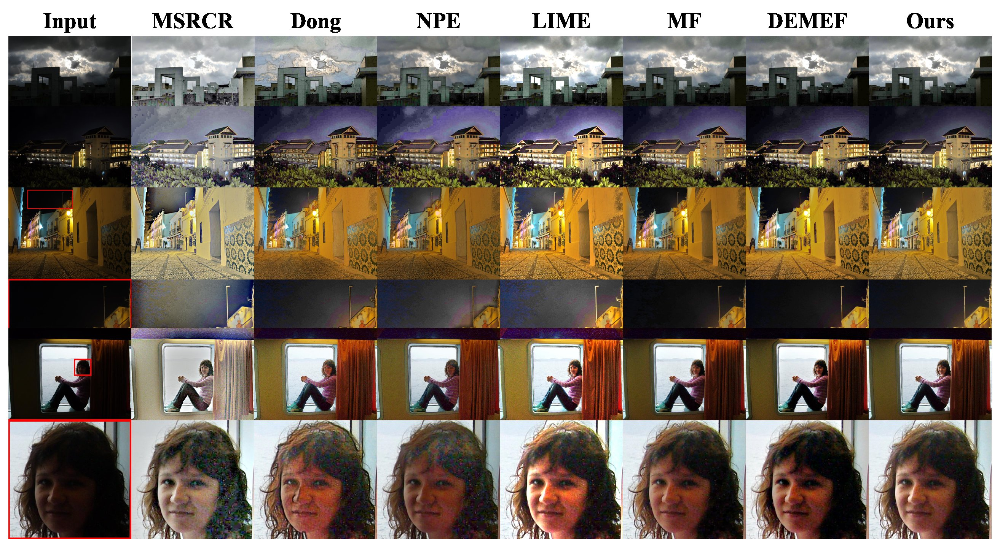

# LECARM

 

 

Code for our paper "[LECARM: Low-Light Image Enhancement using Camera Response Model](https://ieeexplore.ieee.org/document/8340778/)"

* Our paper provides a low-light image enhancment algorithm obtaining the enhanced images by locally adjusting the exposure of input images using camera response model.

* run `run.m` for a demo

* Original code is tested on *Matlab 2016b* 64bit, Windows 10.

* The code for the **comparison methods** is provided, see [lowlight](https://github.com/baidut/BIMEF/tree/master/lowlight).

* The **Datasets** used in our paper in are provided:

  * [DoRF](http://www.cs.columbia.edu/CAVE/software/softlib/dorf.php) (Containing 201 real-world camera response curves)
  * [VV](https://sites.google.com/site/vonikakis/datasets) 
  * [LIME-data](https://sites.google.com/view/xjguo/lime)
  * [NPE-data, NPE-ex1, NPE-ex2, NPE-ex3](http://blog.sina.com.cn/s/blog_a0a06f190101cvon.html)
  * DICM  (69 captured images from commercial digital cameras: [Download (15.3 MB)](http://mcl.korea.ac.kr/projects/LDR/LDR_TEST_IMAGES_DICM.zip))
  * [MEF](https://ece.uwaterloo.ca/~k29ma/)  [dataset](http://ivc.uwaterloo.ca/database/MEF/MEF-Database.php)
  * [IUS](http://projects.ius.edu.ba/ComputerGraphics/HDR/Eurographics/eurographics.html)

* The **quality metrics** used in our papers:

  * LOE: Naturalness Preserved Enhancement Algorithm for Non-Uniform Illumination Images
  * RCDM: A Reduced-Reference Color Distortion Metric for Enhanced Low-light Images (Matlab code coming soon)
  * PCQI: A Patch-Structure Representation Method for Quality Assessment of Contrast Changed Images [ (Download the code)](https://ece.uwaterloo.ca/~k29ma/)

* Comparison with several state-of-the-art methods

  

